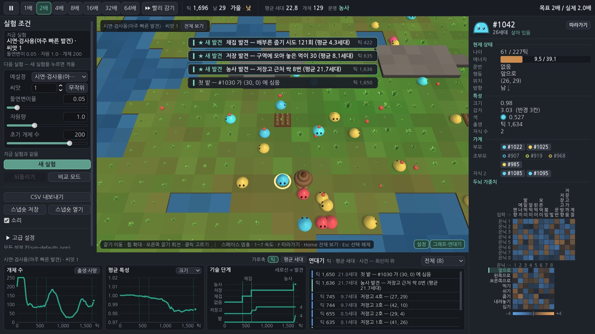
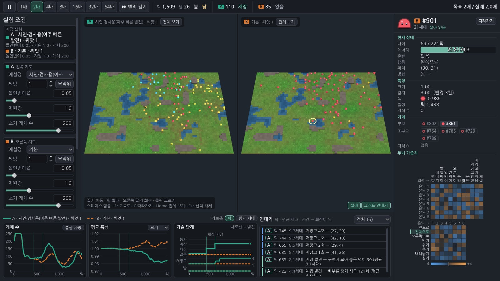
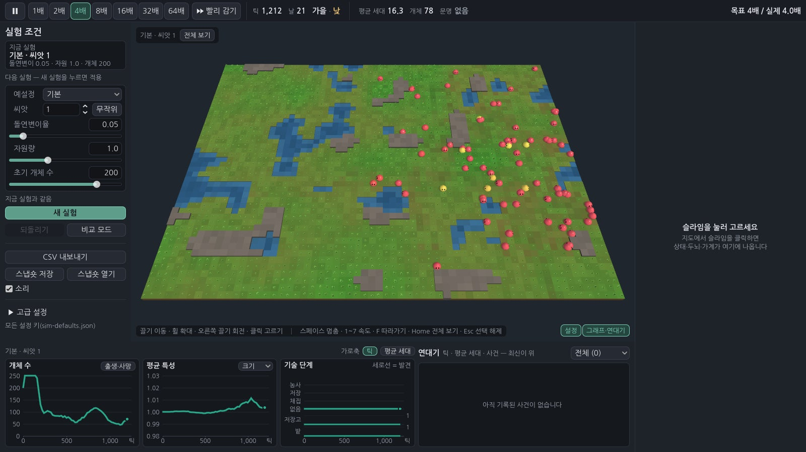
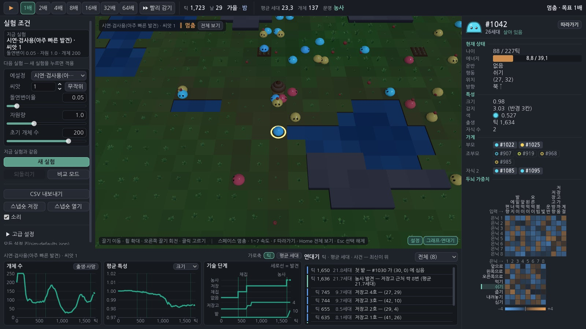
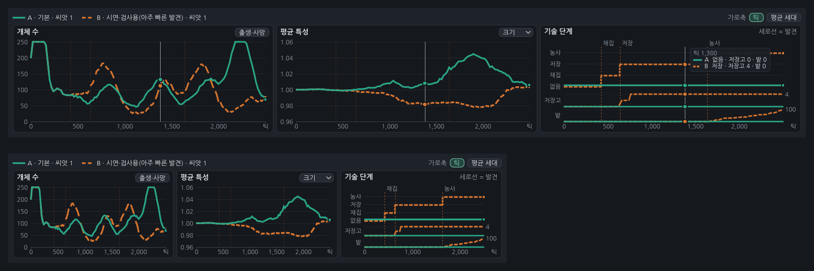
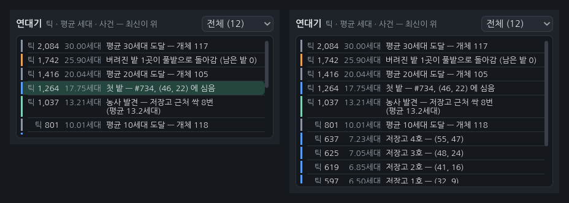
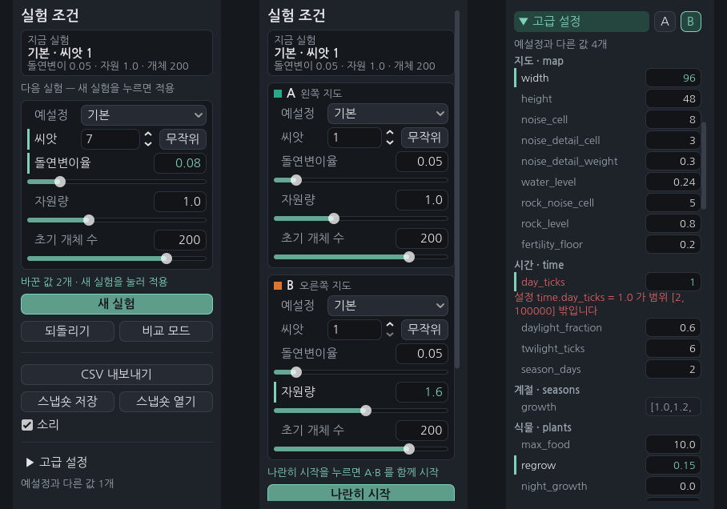

# 슬라임 인공생명 실험실 (slime-lab)

슬라임들이 한 지도 위에서 스스로 먹고, 번식하고, 세대를 거치며 진화하고, 행동이 쌓이면 **발견**(채집 → 저장 → 농사)을 열어 문명을 개척하는 **PC용 연구·관찰 시뮬레이션**입니다. 사용자는 조작하지 않고 실험 조건을 정한 뒤 관찰·분석합니다.

Godot 4.4.1 · GDScript · 오프라인 · 서버·로그인·광고·결제·런타임 생성형 AI 없음 · 한국어

> **현재 상태: 1단계 중 4/5 — 실험실 화면 완성.** 3D 지도 관찰 창·개체 정보 창·속도 조절에 더해 **파라미터 패널(새 실험·고급 설정)·실시간 그래프 3개·연대기·CSV 내보내기·스냅숏 저장/열기·비교 모드(A | B 나란히)·합성 효과음**. 남은 것은 5/5(Actions 빌드·배포 마무리). 진행 순서는 [`docs/DESIGN-v0.1.md`](docs/DESIGN-v0.1.md) 15절.



**비교 모드** — 두 조건(여기서는 시연용 빠른 발견 | 기본)을 같은 배속으로 나란히. 그래프는 A 실선·B 점선을 한 축에, 연대기는 A/B 이름표로 섞어 보여 줍니다. B 지도에서 고른 개체는 정보 창 머리에 B 이름표가 붙습니다.



| 전경(기본·씨앗 1, 패널 펼침) | 같은 자리의 밤 |
|---|---|
|  |  |

| 그래프(비교: 기술 단계 위 마우스 값) | 연대기(첫 밭 줄을 누른 상태) | 실험 조건 패널(혼자 · 비교 · 고급 설정) |
|---|---|---|
|  |  |  |

그림은 모두 코드로 만듭니다(외부 모델·이미지·음원 없음 — 효과음도 실행 중 합성). 캡처는 `tests/ui_driver.gd`(실험실 전체 6장면)·`param_capture.gd`·`graph_capture.gd`·`chronicle_capture.gd`·`map_capture.gd`·`info_capture.gd`·`geo_capture.gd`, 폴더 [`docs/screenshots/v0.1/`](docs/screenshots/v0.1/).

## 어떻게 돌아가나

- **생태:** 64×48 격자(씨앗으로 생성한 풀밭·물·바위). 식물은 비옥도 × 빛(낮밤) × 계절 × 자원량만큼 자랍니다. 슬라임은 에너지·수명이 있고 성숙하면 가까운 짝과 번식합니다.
- **두뇌와 진화:** 슬라임마다 입력 12·은닉 8·출력 8 의 작은 신경망(유전자 160 + 특성 3). 번식 때 은닉 뉴런 단위로 부모 유전자를 섞고 돌연변이를 더합니다. 행동은 출력에 비례한 확률로 고릅니다.
- **문명:** 아직 열리지 않은 행동(줍기·내려놓기·심기)도 고를 수 있고, 고른 "시도"와 그 결과가 쌓여 임계를 넘으면 발견이 열립니다. 저장 발견 때 저장고, 농사 발견 뒤 밭이 생깁니다.
- **결정성:** 같은 씨앗·같은 설정이면 같은 역사(비트 단위). 시뮬레이션 코드는 사칙연산·sqrt 만 씁니다.

## 실험실에서 할 수 있는 것

- **실험 조건(왼쪽):** 예설정·씨앗(무작위)·돌연변이율·자원량·초기 개체 수, 접힌 "고급 설정"에는 `config/sim-defaults.json` 의 모든 값. 값을 바꿔도 진행 중 실험에는 섞이지 않고, 지금 실험과 다른 값이 강조되며 "바꾼 값 N개 · 새 실험을 눌러 적용" 이 뜹니다. 범위 밖 값은 그 줄 바로 아래 빨간 글로 알려 주고 새 실험 단추가 꺼집니다.
- **그래프(아래):** ① 개체 수(+출생·사망) ② 평균 특성(크기·감지·에너지·나이·세대 중 고름) ③ 기술 단계 계단선 + 저장고·밭 수 띠, 발견 시점 세로선. 가로축은 틱 ↔ 평균 세대(셋이 함께). 마우스를 올리면 가장 가까운 기록 줄의 값(비교면 A·B 함께). 수천 줄이어도 화면 폭에 맞춰 줄여(픽셀 열마다 첫·최소·최대·끝) 그립니다.
- **연대기(아래 오른쪽):** 발견·저장고·첫 밭·밭 잃음·세대 이정표·멸종, 최신이 위. 종류별 거르기. 줄을 누르면 그래프에 그 시점 세로선, 행위자가 있으면(첫 밭) 그 개체를 고릅니다.
- **비교 모드:** "비교 모드" → B 칸 조건 → "나란히 시작". 두 세계는 언제나 같은 틱(틱마다 A 다음 B), 사건 알림·연대기에 A/B, 한쪽만 멸종하면 멈추지 않고 살아남은 쪽을 계속 견줍니다.
- **내보내기·스냅숏:** "CSV 내보내기" = 헤드리스 실행기와 같은 결과 폴더(`summary.json`·`timeseries.csv`·`chronicle.csv`·`lineage.csv`·`final.snapshot.json`, 비교면 `A/`·`B/`). 같은 씨앗·설정·틱 수면 `timeseries.csv` 가 실행기 결과와 글자까지 같습니다(검사). 스냅숏 저장 → 열기는 같은 역사 해시에서 이어집니다. 기본 폴더 `user://experiments` = Linux `~/.local/share/slime-lab/experiments`, Windows `%APPDATA%\slime-lab\experiments`.
- **소리:** 발견 차임·멸종 낮은 음·저장고 "톡"(실행 중 코드로 합성, 빨리 감기에서 몰려도 같은 소리는 0.5초에 한 번). 패널의 "소리" 상자로 끔.
- **자리 접기:** 지도 오른쪽 아래 "설정"·"그래프·연대기" 단추로 왼쪽·아래 자리를 접어 지도를 넓힙니다. 최소 창 1280×720 에서도 모든 패널이 창 안에 들어갑니다(검사).

설계와 이유: [`docs/DESIGN-v0.1.md`](docs/DESIGN-v0.1.md) · 화면이 쓰는 시뮬레이션 API: [`docs/SIM-API.md`](docs/SIM-API.md) · 화면 구성 요소 계약: [`docs/VIEW-API.md`](docs/VIEW-API.md) · 여러 실행 분석: [`docs/ANALYSIS.md`](docs/ANALYSIS.md) · 검수: [`docs/TEST-REPORT.md`](docs/TEST-REPORT.md)

## 실행

```bash
godot --headless --path . --import                                   # 최초 1회
godot --path .                                                       # 실험실 화면
godot --path . -- --preset=fast_civ --seed=2                         # 예설정·씨앗을 골라 열기(--snapshot=경로 도)
godot --headless --path . --script res://tests/run_tests.gd          # 규칙 검사(약 1분 반, -- --skip-slow 면 농사 도달 검사 빼고 약 1분)
godot --headless --path . --script res://tests/run_view_tests.gd     # 화면 구성 요소 검사(헤드리스)
godot --headless --path . --script res://tests/run_experiment.gd -- \
    --seed=42 --generations=1000 --out=results/seed42                 # 실험 하나
xvfb-run -a godot --path . --rendering-driver opengl3 --resolution 1600x900 \
    --script res://tests/ui_driver.gd                                 # 화면 동작 확인 + 캡처
python3 tools/analyze.py run --seeds 1-8 --generations 100 --preset fast_civ --out results/fast8   # 씨앗 여러 개 묶음
```

실험실 조작: 끌기 = 이동, 휠 = 확대·축소, 오른쪽 끌기 = 회전, 클릭 = 슬라임 고르기(비교 모드에서는 누른 지도의 실험) · 스페이스 = 멈춤, 1~7 = 속도(1·2·4·8·16·32·64배), F = 따라가기, Home(또는 0) = 모든 지도 전체 보기(지도 위 "전체 보기" = 그 지도만), Esc = 선택 해제. 글 칸(씨앗·숫자)에 입력 중이면 단축키는 동작하지 않고, Enter = 확정, Esc = 입력 취소. 그래프 위 마우스 = 값 읽기, 연대기 줄 클릭 = 그 시점·행위자. 위쪽 막대 오른쪽에 "목표 N배 / 실제 M배"(따라가면 정확히 목표 배속, 시뮬레이션이 프레임 예산에 걸리거나 화면이 아주 느려 실제가 목표의 90% 아래면 경고 색). 개체가 모두 죽으면 그 순간 멈추고 지도 위에 "멸종 · 틱 N" 을 남깁니다(다시 재생하면 빈 지도가 계속).

실행기 선택 인자: `--preset=default|abundant|harsh_winter|fast_civ|demo_fast|no_resources`(`fast_civ` = 연구용, 발견이 진화 도중에 열리고 씨앗 1~12 모두 100세대 안에 농사 — 근거 [`docs/TUNING-fast_civ.md`](docs/TUNING-fast_civ.md); `demo_fast` = 시연·검사용, 2세대 안팎에 농사), `--set=mutation.rate=0.08`(여러 번), `--max-ticks=N`, `--no-lineage`, `--snapshot-every=N`, `--resume=스냅숏.json`, `--quiet`.

결과 폴더: `summary.json`(설정·끝난 이유·발견 시각·역사 해시), `timeseries.csv`(20틱마다), `chronicle.csv`(연대기), `lineage.csv`(모든 개체의 부모·세대·특성), `final.snapshot.json`(이어 돌리기·화면에서 열기).

## 구조

```
config/sim-defaults.json   시뮬레이션 수치의 단일 기준
config/presets.json        실험 예설정
config/ui.json             화면 수치의 단일 기준(색·크기·속도·예산·카메라)
scripts/sim/               규칙(Node·화면 없음): sim_world, sim_brain, sim_terrain, sim_grid, sim_rng, sim_config, sim_snapshot, sim_recorder
scripts/view/              3D: map_view(지도 관찰 창), orbit_camera, slime_geo·proc_geo(절차적 메시)
scripts/ui/                lab_main(주 화면·비교 모드), experiment(세계 + 기록기), param_panel(실험 조건), graph_panel·graph_view(그래프),
                           chronicle_panel(연대기), lab_sound(합성 효과음), info_panel·brain_view(개체 정보·두뇌 열지도), ui_theme, ui_config
scenes/lab.tscn            주 장면
tests/run_tests.gd         규칙 검사
tests/run_view_tests.gd    화면 구성 요소 검사(tests/view/*_checks.gd)
tests/run_experiment.gd    헤드리스 실험 실행기
tests/ui_driver.gd         실험실 화면 동작 확인·캡처(가상 디스플레이), *_capture.gd 구성 요소별 캡처, perf_capture.gd 성능 측정
tools/render_sounds.gd     효과음을 WAV 로 써서 들어 보기(저장소에는 넣지 않음)
tools/analyze.py           오프라인 분석(씨앗 묶음·파라미터 격자 → 표·보고서·그림)
```

## 출처와 라이선스

소스는 [MIT](LICENSE) (저작권 kyusang4657). 함께 들어 있는 글꼴 나눔고딕(`assets/fonts/`, © NHN Corporation)은 SIL OFL 1.1 — 전문 [`assets/fonts/OFL-NanumGothic.txt`](assets/fonts/OFL-NanumGothic.txt). 출처는 [`CREDITS.md`](CREDITS.md).
