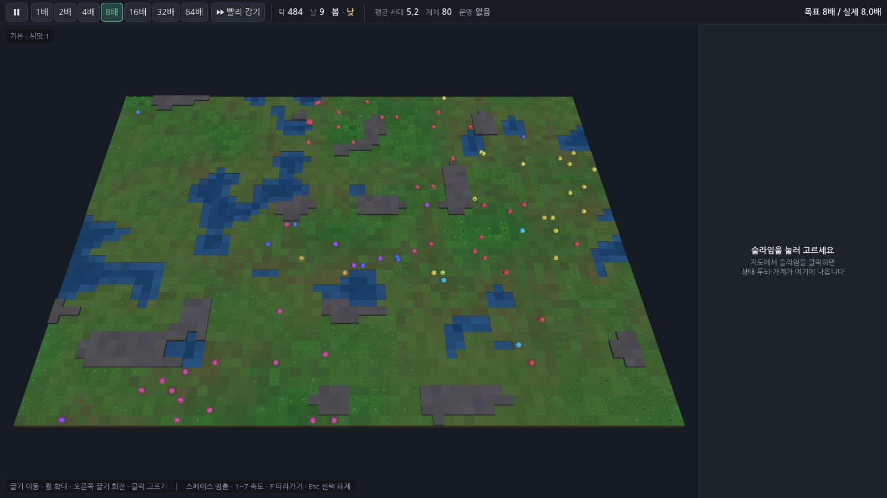

# 슬라임 인공생명 실험실 (slime-lab)

슬라임들이 한 지도 위에서 스스로 먹고, 번식하고, 세대를 거치며 진화하고, 행동이 쌓이면 **발견**(채집 → 저장 → 농사)을 열어 문명을 개척하는 **PC용 연구·관찰 시뮬레이션**입니다. 사용자는 조작하지 않고 실험 조건을 정한 뒤 관찰·분석합니다.

Godot 4.4.1 · GDScript · 오프라인 · 서버·로그인·광고·결제·런타임 생성형 AI 없음 · 한국어

> **현재 상태: 1단계 중 3/5 — 실험실 화면(3D 지도 관찰 창·슬라임 모델·개체 정보 창·속도 조절)과 오프라인 분석 도구.** 파라미터 패널·그래프·연대기·CSV·비교 모드는 다음 단계입니다. 진행 순서는 [`docs/DESIGN-v0.1.md`](docs/DESIGN-v0.1.md) 15절.


| 전경(기본·씨앗 1) | 같은 자리의 밤 |
|---|---|
|  |  |

그림은 모두 코드로 만듭니다(외부 모델·이미지 없음). 캡처는 `tests/ui_driver.gd`·`map_capture.gd`·`info_capture.gd`·`geo_capture.gd`, 폴더 [`docs/screenshots/v0.1/`](docs/screenshots/v0.1/).

## 어떻게 돌아가나

- **생태:** 64×48 격자(씨앗으로 생성한 풀밭·물·바위). 식물은 비옥도 × 빛(낮밤) × 계절 × 자원량만큼 자랍니다. 슬라임은 에너지·수명이 있고 성숙하면 가까운 짝과 번식합니다.
- **두뇌와 진화:** 슬라임마다 입력 12·은닉 8·출력 8 의 작은 신경망(유전자 160 + 특성 3). 번식 때 은닉 뉴런 단위로 부모 유전자를 섞고 돌연변이를 더합니다. 행동은 출력에 비례한 확률로 고릅니다.
- **문명:** 아직 열리지 않은 행동(줍기·내려놓기·심기)도 고를 수 있고, 고른 "시도"와 그 결과가 쌓여 임계를 넘으면 발견이 열립니다. 저장 발견 때 저장고, 농사 발견 뒤 밭이 생깁니다.
- **결정성:** 같은 씨앗·같은 설정이면 같은 역사(비트 단위). 시뮬레이션 코드는 사칙연산·sqrt 만 씁니다.

설계와 이유: [`docs/DESIGN-v0.1.md`](docs/DESIGN-v0.1.md) · 화면이 쓰는 시뮬레이션 API: [`docs/SIM-API.md`](docs/SIM-API.md) · 화면 구성 요소 계약: [`docs/VIEW-API.md`](docs/VIEW-API.md) · 여러 실행 분석: [`docs/ANALYSIS.md`](docs/ANALYSIS.md) · 검수: [`docs/TEST-REPORT.md`](docs/TEST-REPORT.md)

## 실행

```bash
godot --headless --path . --import                                   # 최초 1회
godot --path .                                                       # 실험실 화면
godot --path . -- --preset=fast_civ --seed=3                         # 예설정·씨앗을 골라 열기(--snapshot=경로 도)
godot --headless --path . --script res://tests/run_tests.gd          # 규칙 검사(약 40초)
godot --headless --path . --script res://tests/run_view_tests.gd     # 화면 구성 요소 검사(헤드리스)
godot --headless --path . --script res://tests/run_experiment.gd -- \
    --seed=42 --generations=1000 --out=results/seed42                 # 실험 하나
xvfb-run -a godot --path . --rendering-driver opengl3 --resolution 1600x900 \
    --script res://tests/ui_driver.gd                                 # 화면 동작 확인 + 캡처
python3 tools/analyze.py run --seeds 1-8 --generations 100 --preset fast_civ --out results/fast8   # 씨앗 여러 개 묶음
```

실험실 조작: 끌기 = 이동, 휠 = 확대·축소, 오른쪽 끌기 = 회전, 클릭 = 슬라임 고르기 · 스페이스 = 멈춤, 1~7 = 속도(1·2·4·8·16·32·64배), F = 따라가기, Esc = 선택 해제. 위쪽 막대 오른쪽에 "목표 N배 / 실제 M배"(시뮬레이션이 프레임 예산에 걸리면 실제가 낮게, 경고 색으로 보임).

실행기 선택 인자: `--preset=default|abundant|harsh_winter|fast_civ|no_resources`, `--set=mutation.rate=0.08`(여러 번), `--max-ticks=N`, `--no-lineage`, `--snapshot-every=N`, `--resume=스냅숏.json`, `--quiet`.

결과 폴더: `summary.json`(설정·끝난 이유·발견 시각·역사 해시), `timeseries.csv`(20틱마다), `chronicle.csv`(연대기), `lineage.csv`(모든 개체의 부모·세대·특성), `final.snapshot.json`(이어 돌리기·화면에서 열기).

## 구조

```
config/sim-defaults.json   시뮬레이션 수치의 단일 기준
config/presets.json        실험 예설정
config/ui.json             화면 수치의 단일 기준(색·크기·속도·예산·카메라)
scripts/sim/               규칙(Node·화면 없음): sim_world, sim_brain, sim_terrain, sim_grid, sim_rng, sim_config, sim_snapshot, sim_recorder
scripts/view/              3D: map_view(지도 관찰 창), orbit_camera, slime_geo·proc_geo(절차적 메시)
scripts/ui/                lab_main(주 화면), info_panel·brain_view(개체 정보·두뇌 열지도), ui_theme, ui_config
scenes/lab.tscn            주 장면
tests/run_tests.gd         규칙 검사
tests/run_view_tests.gd    화면 구성 요소 검사(tests/view/*_checks.gd)
tests/run_experiment.gd    헤드리스 실험 실행기
tests/ui_driver.gd         실험실 화면 동작 확인·캡처(가상 디스플레이), *_capture.gd 구성 요소별 캡처, perf_capture.gd 성능 측정
tools/analyze.py           오프라인 분석(씨앗 묶음·파라미터 격자 → 표·보고서·그림)
```

## 출처와 라이선스

소스는 [MIT](LICENSE) (저작권 kyusang4657). 출처는 [`CREDITS.md`](CREDITS.md).
