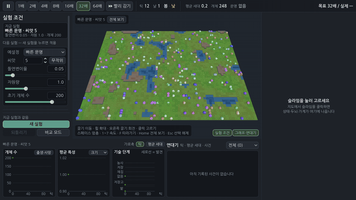

# 슬라임 인공생명 실험실 (slime-lab)

슬라임들이 한 지도 위에서 스스로 먹고, 번식하고, 세대를 거치며 진화하고, 행동이 쌓이면 **발견**(채집 → 저장 → 농사)을 열어 문명을 개척하는 **PC용 연구·관찰 시뮬레이션**입니다. 사용자는 조작하지 않고 실험 조건을 정한 뒤 관찰·분석합니다.

Godot 4.4.1 · GDScript · 오프라인 · 서버·로그인·광고·결제·런타임 생성형 AI 없음 · 한국어

> **현재 상태: 1단계 완료(v0.1.0), 전체 검토에서 확인된 문제 121개 고침.** 시뮬레이션 핵심·헤드리스 실행기·3D 실험실(파라미터·그래프 3개·연대기·비교 모드·CSV·스냅숏·합성 효과음)·분석 도구·자동 검사·Linux·Windows·웹 빌드. 확인한 것과 확인하지 못한 것은 아래 [상태와 한계](#상태와-한계), 검수 기록은 [`docs/TEST-REPORT.md`](docs/TEST-REPORT.md)(맨 앞 절이 검토 고침), 설계와 단계별로 바뀐 것은 [`docs/DESIGN-v0.1.md`](docs/DESIGN-v0.1.md) 15절부터.

| 바로 해 보기 | |
| --- | --- |
| **브라우저 체험판** | **아직 배포되지 않았습니다.** 주소는 https://kyusang4657.github.io/slime-lab/ 로 정해 두었지만 이 저장소의 GitHub Pages 가 꺼져 있어 Actions 의 `pages` 잡이 실패합니다(Pages 단계가 처음 돈 #9 부터 매번). 저장소 소유자가 Settings → Pages → Build and deployment → Source 를 "GitHub Actions" 로 한 번 바꾸고 main 에서 다시 돌려야(새 푸시 또는 Actions 탭 "Run workflow") 올라갑니다 — 그 전에는 이 주소가 열리지 않습니다. 직접 띄우려면 아래 "빌드" 로 만든 `build/web` 을 로컬 웹 서버로 엽니다(PC 브라우저, WebGL2). |
| **Linux·Windows** | GitHub Actions 실행의 산출물(`slime-lab-linux`·`slime-lab-windows`, zip, 30일 보관 — 받으려면 GitHub 로그인). 서명 없음. Windows 실행 파일은 실제 Windows 에서 띄워 본 적이 없습니다(아래 상태와 한계). 태그 `v*` 를 올리면 Release 에도 붙습니다(아직 태그 없음) |
| **소스에서** | 아래 "실행" |




**비교 모드** — 두 조건(여기서는 시연용 빠른 발견 | 기본)을 같은 배속으로 나란히. 그래프는 A 실선·B 점선을 한 축에, 연대기는 A/B 이름표로 섞어 보여 줍니다. B 지도에서 고른 개체는 정보 창 머리에 B 이름표가 붙습니다.


| 전경(기본·씨앗 1·2,412틱, 패널 펼침) | 맨 위 농사 장면(시연용·씨앗 11)과 같은 자리의 밤 |
|---|---|
|  |  |

| 그래프(비교: 기술 단계 위 마우스 값) | 연대기(첫 밭 줄을 누른 상태) | 실험 조건 패널(혼자 · 비교 · 고급 설정) |
|---|---|---|
|  |  |  |

그림은 모두 코드로 만듭니다(외부 모델·이미지·음원 없음 — 효과음도 실행 중 합성). 캡처는 `tests/ui_driver.gd`(실험실 전체 6장면)·`param_capture.gd`·`graph_capture.gd`·`chronicle_capture.gd`·`map_capture.gd`·`info_capture.gd`·`geo_capture.gd`, 폴더 [`docs/screenshots/v0.1/`](docs/screenshots/v0.1/).

## 어떻게 돌아가나

- **생태:** 64×48 격자(씨앗으로 생성한 풀밭·물·바위). 식물은 비옥도 × 빛(낮밤) × 계절 × 자원량만큼 자랍니다. 슬라임은 에너지·수명이 있고 성숙하면 가까운 짝과 번식합니다.
- **두뇌와 진화:** 슬라임마다 입력 12·은닉 8·출력 8 의 작은 신경망(유전자 160 + 특성 3). 번식 때 은닉 뉴런 단위로 부모 유전자를 섞고 돌연변이를 더합니다. 행동은 출력에 비례한 확률로 고릅니다.
- **문명:** 아직 열리지 않은 행동(줍기·내려놓기·심기)도 고를 수 있고, 고른 "시도"와 그 결과가 쌓여 임계를 넘으면 발견이 열립니다. 저장 발견 때 저장고, 농사 발견 뒤 밭이 생깁니다.
- **결정성:** 같은 씨앗·같은 설정·같은 실행 파일이면 같은 역사(비트 단위, 검사). 시뮬레이션 코드는 사칙연산·sqrt 와 허용 목록의 함수만 씁니다(정적 검사). 서로 다른 리눅스 기계 사이는 확인했고, Windows·macOS 와 같은지는 확인하지 못했습니다(아래 상태와 한계).

## 실험실에서 할 수 있는 것

- **실험 조건(왼쪽):** 예설정·씨앗·돌연변이율·자원량·초기 개체 수, 접힌 "고급 설정"에는 `config/sim-defaults.json` 의 모든 값(말풍선에 한국어 이름·단위·범위·뜻 — 모든 키의 설명은 [`docs/CONFIG.md`](docs/CONFIG.md)). 씨앗은 64비트 정수 글 칸이고 "무작위" 단추가 있습니다(소수·식·글자가 섞이면 줄 아래 오류). 값을 바꿔도 진행 중 실험에는 섞이지 않고, 지금 실험과 다른 값이 강조되며 "바꾼 값 N개 · 새 실험을 눌러 적용" 이 뜹니다. 말풍선의 범위는 모두 실제 검사(`SimConfig.validate`)라 범위 밖 값은 그 줄 바로 아래 빨간 글로 알려 주고 새 실험 단추가 꺼집니다. 지도 크기는 1024×1024 까지 받지만 지도 창으로 보기에는 256×256 이하를 권합니다(그리기·시뮬레이션 비용이 칸 수에 비례).
- **그래프(아래):** ① 개체 수(+출생·사망, 20틱당) ② 평균 특성(크기·감지·에너지·나이·세대 중 고름) ③ 기술 단계 계단선 + 저장고·밭 수 띠, 발견 시점 세로선. 가로축은 틱 ↔ 평균 세대(셋이 함께). 마우스를 올리면 가장 가까운 기록 줄의 값(비교면 A·B 함께). 수천 줄이어도 화면 폭에 맞춰 줄여(픽셀 열마다 첫·최소·최대·끝) 그립니다. 스냅숏에서 연 실험은 연 틱부터 다시 기록하므로 그 앞의 발견 세로선이 없고, 그래프 머리에 "기록은 틱 N 부터" 가 보입니다.
- **연대기(아래 오른쪽):** 발견·저장고·첫 밭(`첫 밭 — #N, (x, y) 에 심음`)·밭 잃음·세대 이정표·멸종, 최신이 위. 종류별 거르기. 줄을 누르면 그래프에 그 시점 세로선, 행위자가 있으면(첫 밭) 그 개체를 고릅니다.
- **비교 모드:** "비교 모드" → B 칸 조건 → "나란히 시작". 틱마다 A 다음 B 를 진행해 두 세계는 같은 틱이고, 사건 알림·연대기에 A/B 가 붙습니다. 한쪽만 멸종하면 멈추지 않고 살아남은 쪽을 계속 견주며, 멸종한 쪽은 멸종한 틱에 머뭅니다(위쪽 막대의 틱이 "A값/B값").
- **멸종:** 개체가 모두 죽으면 그 틱에서 멈추고 지도 위에 "멸종 · 틱 N" 을 남깁니다. 멸종한 세계는 헤드리스 실행기처럼 더 진행하지 않습니다(다시 재생해도 그대로, 위쪽 막대 "멸종 · 진행 끝"). 처음부터 개체가 0 인 실험도 틱 0 멸종으로 기록합니다.
- **내보내기·스냅숏:** "CSV 내보내기" = 헤드리스 실행기와 같은 결과 폴더(`summary.json`·`timeseries.csv`·`chronicle.csv`·`lineage.csv`·`final.snapshot.json`, 비교면 `A/`·`B/`). 같은 씨앗·설정·틱 수면 — 멸종한 실험은 멸종까지, 비교 모드에서 한쪽만 멸종해도, 처음부터 개체 0 이어도 — `timeseries.csv`·`chronicle.csv`·`lineage.csv`·`final.snapshot.json` 이 실행기 결과와 글자까지 같습니다(검사. `summary.json` 은 출처 `source = "lab"`·실행 시간 등이 다름). CSV 는 BOM 붙은 UTF-8 이라 한국어 Windows 엑셀에서 두 번 클릭으로 열립니다(pandas 는 그대로, R 은 `fileEncoding = "UTF-8-BOM"`). 스냅숏 저장 → 열기는 같은 역사 해시에서 이어지고, 그래프·내보낸 `timeseries.csv` 는 연 틱부터입니다(스냅숏에는 세계와 연대기만 있음). 저장 대화 상자가 떠 있는 동안 실험이 멈춰 파일 이름의 틱 = 파일 내용입니다. 비교 중 저장은 `<이름>-A.json`·`<이름>-B.json` 두 파일이고, 이미 있으면 덮어쓸지 묻습니다. 열기 대화 상자는 가장 최근 스냅숏을 골라 둔 채 열립니다. 기본 폴더 `user://experiments` = Linux `~/.local/share/slime-lab/experiments`, Windows `%APPDATA%\slime-lab\experiments`(Windows 쪽은 미검증).
- **소리:** 발견 차임·멸종 낮은 음·저장고 "톡"(실행 중 코드로 합성, 빨리 감기에서 몰려도 같은 소리는 0.5초에 한 번). 패널의 "소리" 상자로 끔.
- **화면 크기:** 지도 오른쪽 아래 "실험 조건"·"그래프·연대기" 단추로 왼쪽·아래 자리를 접어 지도를 넓힙니다. 최소 창은 1280×640(768 높이 노트북에 들어감)이고 이 크기에서도 모든 패널이 창 안에 들어갑니다(검사). 시작할 때 창을 화면 작업 영역에 맞춰 줄여 가운데 두고, 화면 배율(Windows DPI·macOS 레티나·웹 `devicePixelRatio`)만큼 UI 를 키웁니다 — OS 가 배율을 알려 주지 않는 X11 HiDPI 는 `ui.lab.ui_scale` 로 직접 정합니다. 웹은 폭 1280 보다 좁은 브라우저 창에서 UI 를 줄여 잘리지 않게 합니다.

**조작:** 끌기 = 이동, 휠 = 확대·축소, 오른쪽 끌기 = 회전, 클릭 = 슬라임 고르기(비교 모드에서는 누른 지도의 실험) · 스페이스 = 멈춤, 1~7 = 속도(1·2·4·8·16·32·64배), F = 따라가기(죽어 기록만 남은 개체는 "죽은 개체는 따라갈 수 없습니다"), Home(또는 0) = 모든 지도 전체 보기(지도 위 "전체 보기" = 그 지도만), Esc = 선택 해제 · Ctrl(맥은 Cmd)+N = 새 실험(비교 모드면 나란히 시작), Ctrl+S = 스냅숏 저장, Ctrl+O = 열기, Ctrl+E = 내보내기 · 아무것도 초점이 없을 때 Tab = 실험 조건 패널 첫 칸, 단추·고르기 상자는 Tab 으로 옮겨 가고 Enter = 누름(스페이스는 그대로 멈춤). 글 칸(씨앗·숫자)에 입력 중이면 단축키는 동작하지 않고(Ctrl 단축키는 됨), Enter = 확정, Esc = 입력 취소. 그래프 위 마우스 = 값 읽기, 연대기 줄 클릭 = 그 시점·행위자(이 둘은 마우스 전용). 위쪽 막대 오른쪽에 "목표 N배 / 실제 M배"(실제는 벽시계로 잼 — 따라가면 정확히 목표 배속, 시뮬레이션이 프레임 예산에 걸리거나 화면이 아주 느려 실제가 목표의 90% 아래면 경고 색).

설계와 이유: [`docs/DESIGN-v0.1.md`](docs/DESIGN-v0.1.md) · 설정 키 설명서: [`docs/CONFIG.md`](docs/CONFIG.md) · 화면이 쓰는 시뮬레이션 API: [`docs/SIM-API.md`](docs/SIM-API.md) · 화면 구성 요소 계약: [`docs/VIEW-API.md`](docs/VIEW-API.md) · 여러 실행 분석: [`docs/ANALYSIS.md`](docs/ANALYSIS.md) · `fast_civ` 조정 근거: [`docs/TUNING-fast_civ.md`](docs/TUNING-fast_civ.md) · 검수: [`docs/TEST-REPORT.md`](docs/TEST-REPORT.md)

## 실행

```bash
godot --headless --path . --import                                   # 최초 1회
godot --path .                                                       # 실험실 화면
godot --path . -- --preset=fast_civ --seed=2                         # 예설정·씨앗을 골라 열기(--snapshot=경로 도)
godot --headless --path . --script res://tests/run_tests.gd          # 규칙 검사(약 2분, -- --skip-slow 면 농사 도달 검사를 빼고 약 1분 반)
godot --headless --path . --script res://tests/run_view_tests.gd     # 화면 구성 요소 검사(헤드리스, 약 3분)
python3 -m unittest discover -s tools -p 'test_*.py'                 # 파이썬 검사(분석 도구·실행기 명령줄·빌드·저장소 규칙)
godot --headless --path . --script res://tests/run_experiment.gd -- \
    --seed=42 --generations=1000 --out=results/seed42                 # 실험 하나
xvfb-run -a godot --path . --rendering-driver opengl3 --resolution 1600x900 \
    --script res://tests/ui_driver.gd                                 # 화면 동작 확인 + 캡처
python3 tools/analyze.py run --seeds 1-8 --generations 100 --preset fast_civ --out results/fast8   # 씨앗 여러 개 묶음
```

검사 시간은 4코어 클라우드 컨테이너에서 잰 값입니다. 실험실 명령줄 인자(`--seed=N`·`--preset=이름`·`--snapshot=경로`)는 `=` 로 붙여 씁니다 — `--seed 5` 처럼 띄어 쓰거나 64비트를 넘는 씨앗은 오류 알림과 함께 기본값으로 엽니다.

**Windows(cmd·PowerShell):** 위 명령은 bash 기준입니다. Windows 에서는

- `godot` 대신 **콘솔 판** `Godot_v4.4.1-stable_win64_console.exe` 를 씁니다(창 판은 콘솔에 출력하지 않아 `RESULT:` 줄이 안 보임). 경로에 빈칸이 있으면 큰따옴표로 감쌉니다.
- `python3` 대신 `py`, 경로 구분은 `\`.
- 줄 끝 `\` 대신 cmd 는 `^`, PowerShell 은 `` ` `` 로 줄을 잇습니다.
- 값에 쉼표·괄호가 있으면 **큰따옴표**("seasons.growth=[1,1,0.5,0]") — cmd 는 작은따옴표를 벗기지 않습니다(`analyze.py` 는 따옴표가 붙은 키를 인자 오류로 알림).
- `tools/*.sh`(빌드·타임랩스)는 bash 가 필요합니다(Git Bash·WSL).

```bat
"C:\Godot\Godot_v4.4.1-stable_win64_console.exe" --headless --path . --script res://tests/run_experiment.gd -- --seed=42 --generations=1000 --out=results/seed42
py tools\analyze.py run --seeds 1-8 --generations 100 --preset fast_civ --godot "C:\Godot\Godot_v4.4.1-stable_win64_console.exe" --out results\fast8
```

PowerShell 예시와 자세한 규칙은 [`docs/ANALYSIS.md`](docs/ANALYSIS.md) "Windows" 절. 리눅스에서 Windows 의 코드 페이지·따옴표 규칙을 흉내 내 검사했고, Windows 에서 직접 돌려 확인하지는 못했습니다.

**실행기 인자:** `--seed=N`(64비트 정수, 기본 1) · `--generations=G`(살아 있는 개체의 평균 세대가 G 에 닿으면 끝, 0 보다 큰 수, 기본 100) · `--out=결과폴더`(꼭 필요) · `--preset=default|abundant|harsh_winter|fast_civ|demo_fast|no_resources` · `--set=키=값`(여러 번, 키와 범위는 [`docs/CONFIG.md`](docs/CONFIG.md)) · `--max-ticks=N`(1~1,000,000,000) · `--no-lineage` · `--snapshot-every=N`(0 = 끔 ~ 1,000,000,000) · `--resume=스냅숏.json` · `--quiet`.

- 수 인자에 글자가 섞이면(`1e5`·`10k`·`abc`) 앞 숫자만 쓰지 않고 인자 오류입니다. 모르는 인자도 오류.
- `--resume` 은 스냅숏의 설정·씨앗으로 이어 돌립니다(끊김 없이 돌린 것과 같은 해시 — 검사). 그래서 `--seed`·`--preset`·`--set` 과 함께 줄 수 없습니다. 이어 돌린 `summary.json` 은 `preset = ""`·`overrides = {}` 와 실제로 읽은 파일(`resumed_from`)을 적습니다.
- 같은 `--out` 을 다시 쓰면 실행기가 쓰는 파일만 지우고 새로 씁니다. 모르는 파일이나 하위 폴더가 하나라도 있으면 아무것도 지우지 않고 거부합니다.
- 종료 코드: 정상 0, 인자·설정·결과 폴더 오류 2, 파일 쓰기 실패 3(마지막 `RESULT:` 줄 끝에 `write_failed=…`). 자세한 규칙은 [`docs/ANALYSIS.md`](docs/ANALYSIS.md) "헤드리스 실행기를 직접 쓸 때".

**예설정:** `default`(기본) · `abundant`(풍요, 자원 1.6배) · `harsh_winter`(혹독한 겨울 — **멸종 조건**: 씨앗 1~12 모두 8,000틱 안에 멸종, 11개는 첫 겨울 중이나 직후) · `fast_civ`(빠른 문명, 연구용 — 씨앗 12개 중 11개는 발견이 진화 도중에 열리고(씨앗 7 은 첫 세대 폭발로 2세대 안에 셋 다), 씨앗 1~12 모두 100세대 안에 농사(중앙값 14.3세대). 씨앗 1·7 은 농사를 연 뒤 멸종 — 근거 [`docs/TUNING-fast_civ.md`](docs/TUNING-fast_civ.md)) · `demo_fast`(시연·검사용 아주 빠른 발견 — 씨앗 1~12 의 농사 중앙값 약 2세대, 씨앗 1 은 13.2세대·1,037틱) · `no_resources`(자원 없음 — 멸종 검사용). 값과 측정 결과는 [`docs/CONFIG.md`](docs/CONFIG.md) 예설정 표.

**결과 폴더:** `summary.json`(설정·끝난 이유·발견 시각·역사 해시), `timeseries.csv`(20틱마다), `chronicle.csv`(연대기), `lineage.csv`(모든 개체의 부모·세대·특성), `final.snapshot.json`(이어 돌리기·화면에서 열기). CSV 셋은 BOM 붙은 UTF-8(JSON 에는 BOM 없음). 쓰는 순서는 `final.snapshot.json` → CSV → `summary.json`(마지막)이라 `summary.json` 이 있으면 다 쓴 결과입니다. 열과 값의 뜻은 [`docs/DESIGN-v0.1.md`](docs/DESIGN-v0.1.md) 8.4절, 여러 실행을 모은 표는 [`docs/ANALYSIS.md`](docs/ANALYSIS.md) "결과 파일".

## 빌드

내보내기 템플릿 4.4.1 이 필요합니다(Linux·Windows·웹 스레드 없는 판, 설정은 `export_presets.cfg`).

```bash
GODOT=godot tools/build_dist.sh [결과폴더=build]     # 세 판 내보내기 + 고지 파일 + zip
xvfb-run -a godot --path . --rendering-driver opengl3 --resolution 512x512 --script res://tests/icon_capture.gd   # 앱 아이콘 다시 만들기
xvfb-run -a godot --path . --rendering-driver opengl3 --resolution 1280x720 --script res://tests/timelapse_capture.gd -- --out=/tmp/tl \
    && tools/make_timelapse.sh /tmp/tl docs/media                     # 타임랩스(webm·mp4·gif·포스터 jpg, ffmpeg)
```

`tools/build_dist.sh` 는 Linux·Windows·웹을 내보내고(`<결과폴더>/linux`·`windows`·`web`), 엔진이 스스로 알려 주는 라이선스로 `GODOT-LICENSE.txt` 를 만들어 고지 파일 넷(`LICENSE`·`CREDITS.md`·`OFL-NanumGothic.txt`·`GODOT-LICENSE.txt`)을 zip 과 웹 묶음에 넣고, `slime-lab-<판>-linux.zip`·`-windows.zip` 으로 묶습니다. 판은 `project.godot` 의 `config/version` 하나에서 읽고, 태그 실행이면 태그가 `v<판>` 이어야 합니다. 내보내기 기록에 WARNING·ERROR 가 있으면 실패합니다. Windows 실행 파일의 아이콘·판 정보(회사·제품·저작권)는 편집기 설정의 rcedit(Linux 에서는 wine 도, `LC_ALL=C.UTF-8`)로 씁니다 — 없으면 경고가 나 실패하므로, 그 설정 없이 한 판만 필요하면 `godot --headless --path . --export-release "Linux" build/linux/slime-lab.x86_64` 처럼 직접 내보냅니다.

`main` 에 푸시하거나 Actions 탭에서 "Run workflow" 를 누르면 GitHub Actions 가 검사(규칙·화면·씨앗 1 의 100세대 실행·파이썬) → 세 판 내보내기(`tools/build_dist.sh`, Linux 실행 파일은 빈 폴더에서 헤드리스로 띄워 주 장면·종료 코드·오류 줄 확인) → 웹 체험판을 GitHub Pages 에 배포합니다(**Pages 가 꺼져 있어 지금은 실패** — 위 "바로 해 보기"). `v*` 태그를 올리면 Linux·Windows zip 을 Release 에 붙입니다(`.github/workflows/build.yml`). 내려받는 Godot·템플릿(`tools/fetch_godot.sh`)과 rcedit 는 SHA-512 로 확인합니다.

웹 체험판은 처음 결정(PC 전용)의 **포트폴리오용 예외**입니다: 같은 시뮬레이션 코드이고, 전체 검토 때 시뮬레이션만 담은 탐침을 같은 웹 템플릿으로 내보내 헤드리스 Chromium 에서 돌린 역사 해시가 리눅스 데스크톱과 비트까지 같았습니다(규칙 고침 전 코드, 고침 뒤에는 다시 재지 않음 — TEST-REPORT). 브라우저에는 고를 파일 시스템이 없어 "CSV 내보내기"·"스냅숏 저장"이 브라우저 내려받기(zip·JSON)로 바뀌고 "스냅숏 열기"는 숨습니다. 브라우저 GDScript 는 데스크톱보다 느려 높은 배속이 덜 나옵니다(화면의 "실제 M배"가 정직하게 보여 줌).

## 구조

```
config/sim-defaults.json   시뮬레이션 수치의 단일 기준
config/sim-labels.json     설정 키마다 한국어 이름·단위·범위(SimConfig.validate 가 검사하는 범위)·뜻 — docs/CONFIG.md 가 여기서 만들어짐
config/presets.json        실험 예설정(측정 결과 메모 포함)
config/ui.json             화면 수치의 단일 기준(색·크기·속도·예산·카메라)
scripts/sim/               규칙(Node·화면 없음): sim_world, sim_brain, sim_terrain, sim_grid, sim_rng, sim_config, sim_snapshot, sim_recorder
scripts/view/              3D: map_view(지도 관찰 창), orbit_camera, slime_geo·proc_geo(절차적 메시)
scripts/ui/                lab_main(주 화면·비교 모드), experiment(세계 + 기록기), param_panel(실험 조건), graph_panel·graph_view(그래프),
                           chronicle_panel(연대기), lab_sound(합성 효과음), info_panel·brain_view(개체 정보·두뇌 열지도), ui_theme, ui_config
scenes/lab.tscn            주 장면
tests/run_tests.gd         규칙 검사
tests/run_view_tests.gd    화면 구성 요소 검사(tests/view/*_checks.gd, 세계 비교 도우미 world_compare.gd)
tests/run_experiment.gd    헤드리스 실험 실행기
tests/ui_driver.gd         실험실 화면 동작 확인·캡처(가상 디스플레이), *_capture.gd 구성 요소별 캡처, perf_capture.gd 성능 측정,
                           icon_capture.gd(앱 아이콘), timelapse_capture.gd(타임랩스 프레임)
export_presets.cfg         Linux·Windows·웹 내보내기(검사·도구·문서는 실행 파일에서 뺌)
assets/icon.png            앱 아이콘(슬라임 모델을 렌더링한 것)
docs/                      설계·계약·분석·검수 문서, docs/media/ 타임랩스(webm·mp4·gif·포스터 jpg), docs/screenshots/v0.1/ 캡처
tools/analyze.py           오프라인 분석(씨앗 묶음·파라미터 격자 → 표·보고서·그림)
tools/build_dist.sh        배포판 만들기(세 판 내보내기·고지 파일·zip), fetch_godot.sh(Godot·템플릿 받기 + SHA-512 확인),
                           smoke_run.sh(내보낸 실행 파일 헤드리스 확인), godot_license.gd(GODOT-LICENSE.txt 만들기)
tools/make_timelapse.sh    타임랩스 프레임을 webm·mp4·gif·포스터로 묶기(ffmpeg), render_sounds.gd(효과음을 WAV 로 — 저장소에는 넣지 않음)
tools/test_*.py            파이썬 검사: test_analyze(분석 도구), test_runner_cli(실행기 명령줄), test_build_ci(워크플로·배포판),
                           test_sim_labels(설정 이름표·CONFIG.md), test_repo_rules(저장소 규칙 — 출처·SIM-API 경계·문서 키)
.github/workflows/build.yml 검사 → 내보내기 → Pages 배포 → (태그) Release
```

## 상태와 한계

확인한 범위는 [`docs/TEST-REPORT.md`](docs/TEST-REPORT.md) 에 통과·실패·미검증으로 나눠 두었습니다. 요약하면:

**확인한 것**

- 자동 검사 — 규칙 351개·화면 구성 요소 1,287개·파이썬 97개 — 가 이 저장소의 클라우드 리눅스 컨테이너와 GitHub Actions(ubuntu-24.04) 모두에서 통과. 실험실 화면은 가상 디스플레이(xvfb + llvmpipe)에서 1600×900·1280×720 으로 띄워 클릭·배속·캡처까지 확인(ui_driver 53·52개).
- 결정성: 같은 씨앗·설정이면 같은 역사 해시, 저장·복원 뒤 이어 돌려도 같음(밭 단계까지). 서로 다른 리눅스 x86_64 기계 사이(이 컨테이너 ↔ Actions: 씨앗 1·100세대 해시 `171a3a4f1a5f`). 웹(wasm) ↔ 리눅스 데스크톱은 검토 때 탐침으로 같음(규칙 고침 전 코드).
- 실험실 내보내기 = 헤드리스 실행기 결과(글자까지), 화면을 거쳐도 시뮬레이션이 바뀌지 않음.
- 배포판: Linux 실행 파일을 빈 폴더에서 헤드리스로 띄워 주 장면이 뜨고 종료 코드 0(Actions). Windows 실행 파일은 아이콘·판 정보를 확인하고 wine 에서 헤드리스로만 띄움. 웹 판은 헤드리스 Chromium(소프트웨어 WebGL2)에서 뜨고 진행.

**확인하지 못한 것(미검증)**

- Windows·macOS 에서 실제로 실행하기(창·입력·사용자 폴더 `%APPDATA%\slime-lab`·위의 Windows 명령줄 안내). macOS 판은 내보내지 않았습니다.
- 플랫폼 간 결정성: Windows·macOS 의 역사 해시가 리눅스와 같은지(설계상 같아야 하지만 확인하지 못함).
- 실제 GPU 에서 200마리 60FPS 와 웹 체험판의 실제 브라우저 속도 — 이 환경에는 GPU 가 없어 소프트웨어 GL(llvmpipe, 약 5FPS)로만 쟀습니다. 화면 배율(Windows 150%·200%, macOS 레티나)과 창 관리자별 첫 창 위치도 실기로는 보지 못했습니다.
- 실제 브라우저에서 사람이 누르는 내려받기 창(zip·JSON — 묶는 바이트는 검사), 운영 체제 파일 대화 상자(엔진 대화 상자로만 확인).
- 효과음을 실제 스피커로 듣기(합성한 파형 바이트만 검사).
- GitHub Pages 체험판 주소(Pages 꺼짐)와 Release(아직 태그 없음).

**목표를 못 맞춘 것**

- **헤드리스 1,000세대 "목표 5분 이내": 실패.** 씨앗 1 의 1,000세대는 112,234틱으로, 이 컨테이너에서 733.8초(12.2분, 기계가 느린 날 — 같은 날 고침 전 코드도 같은 속도였고, 2단계 측정 날에는 7.4분). 5분 안에 넣는 방법(개체 상한 낮추기, 시뮬레이션 핵심을 C#/GDExtension 으로)은 다음 단계에서 정합니다.
- **`fast_civ` 의 세대 목표: 못 맞춤.** 목표(저장 15~35·농사 30~70세대 중앙값)보다 이르고, 검토 고침의 규칙 고침 뒤 문명이 더 빨라졌습니다(저장 5.7·농사 14.3세대, 고침 전 8.6·15.9). 씨앗 1·7 은 농사를 연 뒤 멸종합니다(2/12, 고침 전 0/12). "씨앗 1~12 모두 100세대 안에 농사" 는 그대로입니다.
- 큰 지도(256×256 넘게)는 지도를 붙이는 시간·그리는 삼각형·시뮬레이션 한 틱이 칸 수에 비례해 지도 창으로 보기에 무겁습니다.

## 출처와 라이선스

소스는 [MIT](LICENSE) (저작권 kyusang4657). 함께 들어 있는 글꼴 나눔고딕(`assets/fonts/`, © NHN Corporation)은 SIL OFL 1.1 — 전문 [`assets/fonts/OFL-NanumGothic.txt`](assets/fonts/OFL-NanumGothic.txt). 출처는 [`CREDITS.md`](CREDITS.md). 배포판(zip·웹 묶음)에는 이 셋과 Godot 엔진·제3자 라이선스 고지 `GODOT-LICENSE.txt` 가 함께 들어갑니다(웹 묶음은 `index.html` 옆 — 앱 안에는 라이선스 링크가 없으니 체험판을 싣는 페이지에서 링크하세요).
