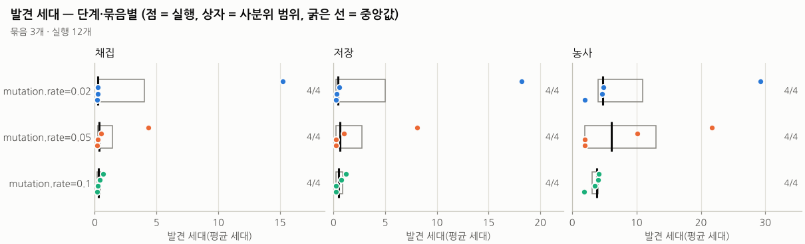

# 오프라인 분석 도구 (`tools/analyze.py`)

헤드리스 실행기(`tests/run_experiment.gd`)를 **씨앗 여러 개 · 파라미터 격자**로 돌리고, 결과 폴더들을 모아 표·보고서·그림을 만드는 파이썬 스크립트입니다. 앱(실험실 화면)에는 들어가지 않습니다 — 앱은 Godot 하나로 오프라인 동작하고, 파이썬은 "여러 번 돌려 비교하기"를 맡습니다.

- 질문 예: "돌연변이율 0.02 와 0.1 중 어느 쪽이 농사를 먼저 여나?", "이 예설정에서 멸종은 몇 번에 한 번?", "씨앗마다 발견 세대가 얼마나 흩어지나?"
- 한 실행의 이야기(지도·개체·연대기)는 실험실 화면에서, **여러 실행의 분포**는 이 도구에서 봅니다.

## 설치

```bash
pip install -r tools/requirements.txt      # numpy, pandas, matplotlib
```

Python 3.9 이상. matplotlib 이 없으면 그림만 건너뛰고 표·보고서는 만듭니다(그렇다고 안내함). godot 4.4.1 이 필요합니다(`--godot` 또는 환경 변수 `GODOT`, 기본 `godot`). 처음 한 번 `godot --headless --path . --import`. 아래 명령은 bash 기준입니다 — Windows(cmd·PowerShell)는 [Windows](#windows) 절.

## 명령

### `run` — 같은 설정, 씨앗 여러 개

```bash
python3 tools/analyze.py run --seeds 1-8 --generations 100 --preset fast_civ --out results/fast8
python3 tools/analyze.py run --seeds 1,3,5 --generations 50 --set mutation.rate=0.08 --set resources.scale=1.4 --out results/mut08
```

씨앗마다 실행기 하나를 `OUT/seed<N>/` 에 돌리고, `OUT/runs.csv` 에 결과 줄(`RESULT: …`)·종료 코드를 적은 뒤 `report` 를 부릅니다.

### `sweep` — 파라미터 격자 × 씨앗

```bash
python3 tools/analyze.py sweep --param mutation.rate=0.02,0.05,0.1 --seeds 1-4 --generations 30 --preset fast_civ --out results/mut-sweep
python3 tools/analyze.py sweep --param mutation.rate=0.02,0.1 --param resources.scale=1,1.6 --seeds 1-4 --out results/grid
```

`--param` 을 여러 번 주면 **전체 격자**(위 둘째 줄은 2 × 2 = 4칸)입니다. 칸마다 `OUT/<키=값__키=값>/seed<N>/`. 보고서는 칸(= 묶음)별로 묶습니다. `--set` 은 모든 칸에 공통으로 덮어쓰고, 같은 키를 `--param` 이 또 주면 격자 값이 이깁니다.

배열 값도 격자로 줄 수 있습니다. 괄호 안의 쉼표는 값을 나누지 않습니다(배열·사전은 JSON 이어야 하고, 괄호가 맞지 않으면 실행 전에 인자 오류). 셸이 괄호를 건드리지 않게 **큰따옴표**로 감쌉니다(bash·cmd·PowerShell 모두 됨. cmd 는 작은따옴표를 벗기지 않아 `'키=값'` 이 따옴표째 넘어오므로, 키에 따옴표가 있으면 실행 전에 인자 오류로 알립니다):

```bash
python3 tools/analyze.py sweep --param "seasons.growth=[1,1,0.5,0],[1,1,1,1]" --seeds 1-4 --out results/winter
```

### `report DIR` — 이미 있는 결과 모으기

```bash
python3 tools/analyze.py report results/mut-sweep                 # 같은 폴더에 보고서
python3 tools/analyze.py report results --out results/모두-보고서   # 여러 묶음을 한 보고서로
```

`DIR` 아래의 `summary.json` 을 모두 찾습니다(실행기를 손으로 돌린 폴더도 됨). **묶음 이름** = 실행 폴더의 부모 폴더 경로(`mutation.rate=0.1` 등). 씨앗 폴더가 `DIR` 바로 아래에 있으면(`run` 결과) 예설정 이름(+덮어쓰기)으로 짓습니다(`fast_civ`, `default+mutation.rate=0.08`).

### 인자

| 인자 | 기본 | 뜻 |
|---|---|---|
| `--seeds` | `1-4` | `1-8`, `1,3,5`, `1-3,7` (겹치면 한 번, 오름차순) |
| `--generations` | `100` | 목표 평균 세대(실행기 `--generations`). 0 보다 큰 10진수·지수 표기(`100`, `2.5`, `1e3`)만 — 실행기가 받지 않는 꼴(`1_0` 등)은 실행 전에 인자 오류 |
| `--preset` | `default` | `config/presets.json` 이름 |
| `--set 키=값` | — | 설정 덮어쓰기, 여러 번. 값은 실행기가 해석(`[1,1,0.5,0]` 같은 배열도 됨) |
| `--param 키=v1,v2` | — | `sweep` 전용, 여러 번 → 격자. 배열 값은 `[..],[..]`(괄호 안 쉼표는 나누지 않음) |
| `--jobs N` | min(4, CPU 수) | 동시에 돌릴 실행기 수 |
| `--godot` | `$GODOT` 또는 `godot` | godot 실행 파일. 경로(`./godot`, `bin/godot`)는 **지금 셸 위치** 기준(`--out`·`--repo` 와 같음 — 실행기는 저장소 폴더에서 돌지만 절대 경로로 바꿔 넘김), 이름만 주면 PATH 에서 찾음 |
| `--repo` | `tools/` 의 부모 | 저장소 위치 |
| `--out` | (필수) | 결과 폴더 |
| `--lineage` / `--no-lineage` | `--no-lineage` | 묶음에서는 `lineage.csv`(1,000세대면 8MB)를 기본으로 쓰지 않음 |
| `--max-ticks` | 설정값 | 틱 상한 |
| `--timeout` | `3600` | 실행 하나의 시간 제한(초). 넘으면 그 실행만 끝내고 `timeout` 으로 기록 |
| `--no-report`, `--no-plots` | — | 보고서 / 그림 끄기 |
| `--lang` | `auto` | 그림 문구 `ko`·`en`. `auto` 는 나눔고딕(`assets/fonts`)을 쓸 수 있으면 한국어 |

**이어 돌리기:** 끝까지 쓴 결과가 이미 있는 씨앗 폴더는 건너뜁니다. 같은 명령을 다시 주면 실패·중단된 것만 다시 돌립니다(`runs.csv` 의 이전 성공 줄은 그대로 둠). "끝까지 쓴 결과" = `summary.json` 이 읽히고 역사 해시가 있으며 `write_failed` 가 비었고 `timeseries.csv`·`chronicle.csv`·`final.snapshot.json` 이 비어 있지 않게 있는 것. 실행기는 쓰다가 실패해도(종료 코드 3) `summary.json` 을 남길 수 있으므로, 이 조건을 못 채우거나 `runs.csv` 의 이전 상태가 `failed`·`timeout`·`error` 이면 `summary.json` 이 있어도 **다시 돌립니다**(`다시 돌림(까닭)` 출력 — 실행기가 그 폴더의 앞 결과 파일을 지우고 새로 씀). 건너뛰기 전에 그 결과의 예설정·목표 세대·덮어쓰기·**틱 상한**(실행기가 `summary.json` 의 `max_ticks` 에 실제로 쓴 상한, 이번 요청은 `--max-ticks` 또는 설정의 `run.max_ticks`)을 이번 요청과 비교해, 다르면 덮어쓰지 않고 경고와 함께 `mismatch` 로 기록합니다(보고서의 실패 표에 나옴). 예: `--max-ticks 2000` 으로 시험한 폴더에 상한 없는 본 실행을 주면 잘린 결과를 쓰지 않고 알립니다(`max_ticks` 기록이 없는 예전 결과는 설정값으로 봅니다). 설정을 바꿨으면 다른 `--out` 을 쓰세요. 종료 코드: 모두 성공 0, 실패·mismatch 가 있으면 1, 인자·저장소 오류 2.

## 결과 파일

```
OUT/
  runs.csv                 실행 기록: cell, seed, status(ok·failed·timeout·error·existing·mismatch), exit_code, wall_seconds, result(RESULT 줄), out_dir, command
  summary.csv              실행마다 한 줄 (아래)
  cells.csv                묶음마다 한 줄 (아래)
  report.md                한국어 보고서(표 + 그림 + 읽는 법)
  population.png  mean_gen.png  traits.png  civ_stage.png  discovery.png
  seed1/  …                실행기 결과(summary.json, timeseries.csv, chronicle.csv, final.snapshot.json) + run.log
```

씨앗 폴더의 실행기 결과 파일(`timeseries.csv`·`chronicle.csv`·`lineage.csv`·`summary.json`·스냅숏)의 열 뜻·구간 값과 누적 값·틱 기준(진행 중인 틱 번호와 진행한 뒤 틱)·`death_cause` 같은 코드는 [`DESIGN-v0.1.md`](DESIGN-v0.1.md) 8.3·8.4 가 정본입니다. 아래는 `analyze.py` 가 만드는 표입니다.

`summary.csv`·`cells.csv`·`runs.csv` 는 **BOM 붙은 UTF-8** 입니다 — 한국어 Windows 엑셀이 두 번 클릭으로 열어도 `civ_stage_name`(농사)·`result` 의 한글이 깨지지 않습니다(BOM 이 없으면 엑셀은 시스템 코드 페이지 cp949 로 읽음). pandas(`pd.read_csv`)·파이썬 `csv`(`encoding="utf-8-sig"`)·LibreOffice 는 그대로 읽고, R 은 `read.csv(파일, fileEncoding = "UTF-8-BOM")`. 실행기·실험실이 쓰는 `timeseries.csv`·`chronicle.csv`·`lineage.csv` 도 BOM 붙은 UTF-8 입니다(같은 규칙 — 엑셀 두 번 클릭, pandas 는 그대로, R 은 위와 같이. `summary.json`·스냅숏 같은 JSON 에는 BOM 을 붙이지 않음). `analyze.py` 는 BOM 이 있어도 없어도 읽습니다.

**`summary.csv`** (BOM 붙은 UTF-8, 쉼표, 영문 열 이름, 빈 값 `NaN`):

| 열 | 뜻 |
|---|---|
| `cell`, `seed`, `preset`, `overrides`, `generations_target` | 묶음, 씨앗, 예설정, 실제 덮어쓰기(`키=값;…`), 목표 세대. 스냅숏에서 이어 돌린 실행(실험실에서 스냅숏을 연 실험도)은 예설정을 알 수 없어 `preset` 이 비고 `overrides` 도 비며, 루트 바로 아래면 묶음 이름이 `snapshot` |
| `end_reason` | `generations`(목표 도달) · `extinction` · `max_ticks` |
| `ticks`, `mean_generation`, `population`, `peak_population`, `births`, `deaths` | 끝날 때 값(`summary.json` — `births`·`deaths` 는 누적 `total_births`·`total_deaths`). 단 **멸종한 실행의 `mean_generation`** 은 빈 개체의 평균(0)이 아니라 살아 있던 마지막 시계열 줄(멸종 최대 20틱 전)의 평균 세대(`final_mean_size` 와 같은 방식, 시계열이 없으면 NaN) |
| `civ_stage`, `civ_stage_name` | 끝날 때 문명 단계 0~3(없음·채집·저장·농사) |
| `extinct_tick`, `storehouses`, `farms` | 멸종 틱(-1 없음), 저장고·밭 수 |
| `disc_tick_forage` · `disc_gen_forage` (`_store`, `_farm`) | 채집(저장·농사) **발견 틱(-1)·발견 세대(NaN = 발견 못 함)**. 발견 틱은 발견한 틱 번호(진행 중인 틱 — 시계열에는 다음 줄부터 보임, DESIGN 8.4) |
| `final_mean_size`, `final_mean_sense` | 살아 있던 마지막 기록의 평균 크기·감지 반경(`timeseries.csv` 의 `mean_sense` — 반올림한 반경의 평균이라 `lineage.csv` 의 `sense` 유전자 평균과 다름) |
| `run_seconds`, `history_hash`, `path` | 실행기 시간, 역사 해시(64자), 실행 폴더(상대 경로) |

**`cells.csv`**: `runs`, `extinct`·`extinction_rate`, `reached_<단계>`·`reach_rate_<단계>`(끝 단계가 그 이상인 실행 수·비율), `disc_gen_<단계>_n/_median/_q1/_q3/_iqr`(도달한 실행만), `mean_generation_median`, `ticks_median`, `population_median`, `peak_population_median`, `final_mean_size_median`, `final_mean_sense_median`, `run_seconds_median`, `run_seconds_total`.

## 그림

모두 실행마다 얇은 선(또는 점) 하나이고, 색 = 묶음(고정 순서 8색). 묶음이 8개를 넘으면 색을 돌려쓰지 않고 **묶음마다 작은 그림**(가로 4칸씩)으로 나눕니다(특성 그림은 `traits_mean_size.png`·`traits_mean_sense.png` 두 장). 묶음이 둘 이상이면 아래에 범례, 하나면 부제에 이름.

| 파일 | 보이는 것 |
|---|---|
| `population.png` | 개체 수 대 틱. 멸종한 실행은 끝에 ×. 상한(`population.cap`, 기본 250)에 붙은 구간은 먹이가 아니라 상한이 개체 수를 정함 |
| `mean_gen.png` | 평균 세대 대 틱. 기울기 = 세대 교체 속도 |
| `traits.png` | 평균 크기(왼쪽)·평균 감지 반경(오른쪽, 반올림한 칸 수의 평균) 대 평균 세대. 개체 0 인 줄(평균 열이 0.0)은 뺌. 거의 변하지 않을 때 잡음이 커 보이지 않게 세로 범위를 최소 0.2·1.0 으로 둠 |
| `civ_stage.png` | 문명 단계 계단선 대 평균 세대. 겹치지 않게 실행마다 세로로 조금씩 띄움. 멸종한 실행은 끝에 × |
| `discovery.png` | 단계(채집·저장·농사)마다 한 칸, 세로 = 묶음. 점 = 실행, 회색 상자 = 사분위 범위(실행 3개 이상), 검은 선 = 중앙값, 오른쪽 = 도달 수/전체 |

## 발견 세대는 이렇게 계산합니다

1. 실행의 `chronicle.csv` 에서 `kind = discovery` 인 줄을 찾습니다. 시뮬레이션이 발견 순간에 `mean_gen`(평균 세대, 0.01 단위로 반올림)을 함께 적습니다 — 채집·농사는 그 틱을 진행한 뒤 살아 있는 개체, 저장은 진행 전 개체의 평균입니다(행동 도중에 열리므로, DESIGN 8.4 "틱 기준").
2. 단계는 문장 머리 `채집 발견 — …`·`저장 발견 — …`·`농사 발견 — …` 로 가립니다. 머리가 다르면(문구가 바뀐 경우) `summary.json` 의 `discovery_ticks` 와 **같은 틱**의 사건으로 맞춥니다.
3. 연대기가 없거나 사건이 빠졌는데 `summary.json` 에 발견 틱이 있으면, `timeseries.csv` 의 평균 세대를 그 틱으로 선형 보간합니다(근사).
4. 발견하지 못한 단계는 틱 -1, 세대 `NaN`. 묶음 통계(중앙값·사분위)는 **도달한 실행만**으로 계산하고, 도달 비율을 따로 적습니다.

사분위는 numpy 기본(선형 보간) 백분위수입니다.

## 주의

- **시간:** 기본 설정에서 실행 하나가 세대당 약 110틱이고, 속도는 기계에 따라 평균 약 150~250틱/초 → **세대당 약 0.45~0.73초**(1,000세대 ≈ 7.4분(2단계 기계)~12.2분(검토 고침 날 4코어 공유 기계) — `docs/TEST-REPORT.md`, `docs/DESIGN-v0.1.md` 13절). 전체 ≈ 묶음 수 × 씨앗 수 × 세대 × 세대당 시간 ÷ `--jobs`. CPU 코어보다 `--jobs` 를 크게 주면 빨라지지 않습니다. 아래 예시의 `run`(`fast_civ` 100세대 씨앗 8개)은 그 공유 기계에서 `--jobs 3` 으로 114초(실행 하나 3.3~61.3초 — 일찍 멸종한 씨앗 1·7 은 짧음), `sweep`(12개 × 60세대)은 84초였습니다.
- **`run_seconds`** 는 동시에 돌던 다른 실행과 CPU 를 나눈 시간입니다. 성능 비교에는 `--jobs 1` 로.
- **결정성:** 같은 씨앗·같은 설정·같은 코드면 역사 해시가 같습니다(병렬로 돌려도). 같은 결과 폴더로 `report` 를 다시 만들면 `summary.csv`·`cells.csv`·`report.md` 는 바이트까지 같습니다(검사함. `summary.csv`·`cells.csv` 는 pandas 2.2 와 3.0 사이에서도 같음을 확인). 실행을 다시 돌리면 `run_seconds` 만 달라집니다. 해시가 다르면 설정이나 코드가 다른 것입니다.
- **중도 절단:** 목표 세대에서 멈추므로, 그보다 늦게 올 발견은 "도달 못 함"으로 셉니다. 늦은 단계를 비교할 때는 목표 세대를 넉넉히.
- **평균 세대는 단조롭지 않을 수 있습니다**(나이 많은 고세대 개체가 한꺼번에 죽으면 잠깐 내려감). 문명 단계 그림의 가로축이 잠깐 뒤로 가는 것은 그 때문입니다.
- 결과 폴더를 저장소 안(`results/…`, git 에서 무시됨)에 두어도 Godot 가 CSV(번역 표로)·PNG(텍스처로)를 가져오지 않게, 실행기는 씨앗 폴더에, `analyze.py` 는 자기가 쓰는 폴더(`run`·`sweep` 의 `--out`, `report --out`)에 빈 `.gdignore` 를 넣습니다. Godot 은 `.gdignore` 가 있는 폴더의 하위 폴더도 모두 건너뜁니다.
- 묶음 순서는 폴더 이름의 자연 순서입니다(숫자 덩어리는 수로: `rate=0.02` < `rate=0.1`, `trial-2` < `trial-10`). `-` 는 이름 맨 앞이나 `=` 바로 뒤에서만 음수 부호(`rate=-0.5` < `rate=0.1`)이고, 그 밖에서는 구분자입니다.
- 실행기 출력(`RESULT:` 줄의 한글 등)은 OS 의 코드 페이지와 무관하게 UTF-8 로 읽고, `analyze.py` 자신의 출력(진행 줄·안내)도 UTF-8 로 씁니다 — Windows 는 출력을 파일·파이프로 돌리면(`> log.txt`, CI) ANSI 코드 페이지(cp949·cp1252)를 strict 로 써서 `—`·한글에서 죽었으므로 시작할 때 표준 출력·오류를 UTF-8 로 다시 설정합니다(`PYTHONUTF8` 없이도 됨. 콘솔 창에서는 원래대로 보임).
- 씨앗 4개 정도의 사분위 범위는 거칩니다. 결론을 내기 전에 씨앗을 늘리세요.

## 예시 (`docs/analysis/example/`)

이 저장소에 함께 올린 작은 예시입니다(원본 실행 폴더는 올리지 않음, 보고서·표·그림만). 아래 두 명령으로 만든 `results/example-run/`·`results/example-sweep/` 의 `report.md`·`summary.csv`·`cells.csv`·`*.png` 를 그대로 `docs/analysis/example/run/`·`sweep/` 에 복사한 것입니다 — 다시 돌리면 `run_seconds`(보고서의 시간 열)만 다르고 나머지는 같습니다(검사: `test_analyze.py` 가 보고서의 결과 폴더 이름이 이 명령의 `--out` 과 같은지 봄).

```bash
python3 tools/analyze.py run   --seeds 1-8 --generations 100 --preset fast_civ --out results/example-run --jobs 3
python3 tools/analyze.py sweep --param mutation.rate=0.02,0.05,0.1 --seeds 1-4 --generations 60 --preset fast_civ \
                               --out results/example-sweep --jobs 3
for k in run sweep; do cp results/example-$k/{report.md,summary.csv,cells.csv,*.png} docs/analysis/example/$k/; done
```

(마지막 줄은 bash 의 복사입니다. Windows 에서는 두 폴더의 `report.md`·`summary.csv`·`cells.csv`·`*.png` 를 탐색기로 같은 자리에 복사하면 됩니다 — 실행 명령의 Windows 꼴은 [Windows](#windows) 절.)

- [`run/report.md`](analysis/example/run/report.md) — `fast_civ`(조정 기록 [`TUNING-fast_civ.md`](TUNING-fast_civ.md)) 씨앗 8개 × 100세대. 8개 모두 농사까지 도달하고, 2개는 농사를 연 뒤 멸종(씨앗 1 은 3,693틱, 씨앗 7 은 1,153틱). 발견 세대 중앙값 [사분위] 채집 10.4 [3.1–22.7] · 저장 12.1 [3.6–24.7] · 농사 18.9 [8.6–30.6](씨앗별 농사 28.5 · 9.9 · 55.5 · 23.6 · 14.1 · 36.8 · 1.9 · 4.8). 씨앗 1 의 농사(2,040틱, 28.5세대)는 규칙 검사 S15(`test_farm_reachable`)가 같은 씨앗으로 다시 얻는 값입니다(결정성).
- [`sweep/report.md`](analysis/example/sweep/report.md) — 돌연변이율 0.02·0.05·0.1 × 씨앗 4개 × 60세대. 멸종 1/4 · 1/4 · 0/4(0.02 의 씨앗 1 은 아무 발견 없이 618틱에, 0.05 의 씨앗 1 은 농사를 연 뒤 3,693틱에), 농사 도달 3/4 · 4/4 · 4/4(60세대에서 멈추므로 늦은 씨앗은 "도달 못 함"이 될 수 있음 — 중도 절단), 농사 세대 중앙값 16.7 · 26.1 · 20.1. 0.05(기본값과 같음) 칸은 위 `run` 의 씨앗 1~4 와 60세대까지 같은 역사입니다(채집 21.70 · 3.31 · 25.89 · 13.97세대로 같음). 0.1 에서 씨앗 2 는 첫 세대 폭발로 채집이 0.33세대에 열리고, 씨앗 1 의 채집은 18.5세대(0.05 에서 21.7)입니다. 씨앗 4개라 칸 사이 차이는 아직 결론이 아닙니다.
- 읽을거리: 조정한 `fast_civ` 에서도 씨앗 7 은 채집·저장·농사를 모두 **2세대 안에**(0.23 · 0.34 · 1.89세대) 엽니다 — 첫 1세대(약 190틱) 동안 무작위 두뇌의 배부른 줍기 시도가 약 390회로 임계 280 을 바로 넘음(임계를 끈 실행으로 잰 값). 그리고 1,153틱에 멸종합니다. 반대로 씨앗 1·3·6 은 채집 21.7~27.7세대, 농사 28.5~55.5세대입니다. 같은 설정에서도 씨앗 사이 퍼짐이 이렇게 크므로 씨앗을 넉넉히 쓰세요(분포와 그 까닭은 [`TUNING-fast_civ.md`](TUNING-fast_civ.md)).



## 헤드리스 실행기를 직접 쓸 때

`analyze.py` 가 씨앗마다 부르는 `tests/run_experiment.gd` 를 손으로 돌릴 수도 있습니다(인자 목록은 README "실행"). 규칙은 실행기 머리 주석과 같습니다.

```bash
godot --headless --path . --script res://tests/run_experiment.gd -- --seed=42 --generations=1000 --out=results/seed42
godot --headless --path . --script res://tests/run_experiment.gd -- --seed=42 --max-ticks=20000 --snapshot-every=10000 --out=results/a
godot --headless --path . --script res://tests/run_experiment.gd -- --resume=results/a/snapshot-10000.json --max-ticks=20000 --out=results/b
```

- **수 인자:** `--seed` 는 64비트 정수, `--generations` 는 0 보다 큰 유한한 수, `--max-ticks` 는 1~1,000,000,000(`SimConfig.TICK_MAX` — 설정의 틱 키와 같은 상한, 틱을 담는 배열의 2^31−1 안), `--snapshot-every` 는 0(끔)~1,000,000,000 의 정수. `1e5`·`10k`·`abc` 처럼 글자가 섞이면 앞 숫자만 쓰지 않고 **인자 오류(종료 코드 2)** 입니다. 상대 경로(`--out`·`--resume`)는 프로젝트 폴더(`--path`) 기준.
- **이어 돌리기(`--resume`):** 설정·씨앗은 스냅숏의 것을 씁니다. `--seed`·`--preset`·`--set` 을 함께 주면 무시하지 않고 인자 오류(2). 끊김 없이 돌린 것과 같은 역사 해시가 나옵니다(검사). 이어 돌린 `summary.json` 은 `preset = ""`·`overrides = {}`(스냅숏에는 예설정 이름이 없음 — 실제 설정은 `config`), `resumed_from` = 실제로 읽은 파일, `resume_status` = `loaded`(본 파일) 또는 `backup` — 본 파일이 깨져 직전 정상본(`.bak`)에서 읽었으면 경고 줄을 찍고 `resumed_from` 에 `.bak` 경로를 적습니다(`.bak` 은 같은 이름으로 앞서 저장한 다른 실험일 수 있음). 이어 돌릴 스냅숏이 `--out` 폴더 바로 안이면 거부(2). 이어 돌리자마자 끝나도(틱 상한 ≤ 스냅숏 틱) 시계열은 그 틱 한 줄입니다(실험실에서 스냅숏을 연 것과 같음).
- **결과 폴더(`--out`):** 없거나 비었으면 그대로 씁니다. 실행기가 쓰는 파일(`summary.json`·`timeseries.csv`·`chronicle.csv`·`lineage.csv`·`final.snapshot.json`·`snapshot-<틱>.json`, 그리고 그 `.tmp`·`.bak`·`.broken`)만 있으면 **그것을 모두 지우고** 새로 씁니다 — 같은 폴더를 다시 써도 앞 실행의 `lineage.csv`(`--no-lineage` 일 때)·`snapshot-N.json`·`.bak` 이 새 결과 옆에 섞여 남지 않습니다. `.gdignore`·`run.log`(`analyze.py` 의 기록)·OS 가 만드는 파일(`.DS_Store`·`Thumbs.db`·`desktop.ini`)은 그대로 둡니다. **그 밖의 파일이나 하위 폴더가 하나라도 있으면 아무것도 지우지 않고** 오류(2) — 사용자 파일을 지우지 않으려고 실행기가 모르는 것은 건드리지 않습니다(빈 폴더나 새 `--out` 을 주세요). 설정 오류는 폴더를 보기 전에 걸러지므로 앞 결과가 그대로 남습니다.
- **쓰는 순서:** 중간 스냅숏(`--snapshot-every`) → `final.snapshot.json` → CSV → `summary.json`(마지막 — 임시 이름으로 쓴 뒤 바꿈. CSV 를 하나라도 못 쓰면 `summary.json` 은 쓰지 않음). 그래서 `summary.json` 이 있으면 다 쓴 결과입니다. `summary.json` 의 `write_failed` = 그보다 먼저 쓰지 못한 파일(중간·최종 스냅숏). 실험실의 결과 폴더 내보내기도 같은 순서입니다.
- **종료 코드:** 정상 0, 인자·설정·결과 폴더 오류 2, 파일 쓰기 실패 3(중간 스냅숏 포함 — 실패마다 오류 줄을 찍음). 마지막 줄 `RESULT: … reason=<끝난 이유>` 는 정상이면 `reason=…` 으로 끝나고, 쓰기 실패면 끝에 ` write_failed=파일(까닭),…` 이 붙습니다(CI 처럼 판정할 때는 종료 코드나 줄 끝까지 맞춘 `reason=generations$` 로). 씨앗은 `INT64_MIN` 도 그대로(`seed=-9223372036854775808`).
- 검사: `tools/test_runner_cli.py`(실제 godot 을 명령줄 그대로 불러 위 규칙을 확인 — godot 이 없으면 건너뛰지 않고 실패).

## Windows

대상 플랫폼이라 같은 일을 cmd·PowerShell 로 하는 법입니다(리눅스에서 Windows 의 코드 페이지·따옴표 규칙을 흉내 내 검사함 — Windows 에서 직접 돌려 확인하지는 못함).

- 파이썬은 python.org 설치판의 `py`(또는 `python`), 경로 구분은 `\`.
- godot 은 **콘솔 판**(`Godot_v4.4.1-stable_win64_console.exe`)을 씁니다 — 창 판은 콘솔에 출력하지 않아 `RESULT:` 줄이 안 보입니다. 경로에 빈칸이 있으면 큰따옴표로.
- 값에 쉼표·괄호가 있으면 **큰따옴표**(cmd 는 작은따옴표를 벗기지 않음 → 키에 따옴표가 붙어 인자 오류로 알림). PowerShell 은 작은따옴표도 되지만 큰따옴표가 둘 다에서 됩니다.
- 줄잇기: cmd 는 줄 끝 `^`, PowerShell 은 줄 끝 `` ` ``(bash 의 `\` 대신).
- `runs.csv` 의 `command` 열은 Windows 에서 cmd 따옴표 규칙(`subprocess.list2cmdline`)으로 적혀 그대로 붙여 다시 돌릴 수 있습니다(그 밖의 OS 는 POSIX `shlex`).
- 출력을 파일로 돌려도(`> log.txt`) UTF-8 로 쓰므로 죽지 않습니다. 메모장·VS Code 는 그대로 읽습니다.

```bat
:: cmd
py tools\analyze.py sweep --param "mutation.rate=0.02,0.1" --param "seasons.growth=[1,1,0.5,0],[1,1,1,1]" ^
   --seeds 1-4 --generations 30 --preset fast_civ ^
   --godot "C:\Godot\Godot_v4.4.1-stable_win64_console.exe" --out results\grid
"C:\Godot\Godot_v4.4.1-stable_win64_console.exe" --headless --path . --script res://tests/run_experiment.gd -- --seed=42 --generations=100 --out=results/seed42
```

```powershell
# PowerShell
py tools\analyze.py run --seeds 1-8 --generations 100 --preset fast_civ `
   --godot "C:\Godot\Godot_v4.4.1-stable_win64_console.exe" --out results\fast8
$env:GODOT = "C:\Godot\Godot_v4.4.1-stable_win64_console.exe"   # 한 번 정해 두면 --godot 생략
py tools\analyze.py report results\fast8
```

## PyTorch 를 쓰지 않는 이유

분석에는 numpy·pandas·matplotlib 만 씁니다. 시뮬레이션에도 PyTorch 를 넣지 않았습니다.

1. **두뇌가 아주 작습니다.** 개체마다 12-8-8 앞먹임 신경망(곱셈 약 160회/판단). 250마리를 한 번에 계산해도 GPU·텐서 라이브러리의 시동 비용이 계산보다 큽니다.
2. **경사 하강을 쓰지 않습니다.** 학습은 신경진화(번식 때 유전체 교차 + 돌연변이, 살아남은 쪽이 남음)입니다. 자동 미분·최적화기가 필요 없습니다.
3. **결정성.** 같은 씨앗이면 비트 단위로 같은 역사(사칙연산·sqrt 만, `docs/DESIGN-v0.1.md` 7절). GPU·병렬 커널은 덧셈 순서가 바뀌어 결과가 기계마다 달라질 수 있습니다.
4. **오프라인 단일 실행 파일.** 앱은 Godot 하나로 설치 없이 돌아가야 합니다. 수백 MB 의 파이썬·PyTorch 런타임을 넣을 수 없습니다.

파이썬이 맞는 자리는 여기 — 여러 실행을 모아 통계·그림을 만드는 **오프라인 분석**입니다. 나중에 정말 큰 모델로 행동을 학습시켜 보고 싶다면(예: 진화한 두뇌를 모방 학습), 그것도 이 도구처럼 앱 바깥의 별도 실험으로 두는 것이 맞습니다.

## 검사

```bash
python3 -m unittest discover -s tools -p "test_*.py" -v
```

`tools/test_analyze.py`: 가짜 결과 폴더(묶음 2개 × 씨앗 2개)로 `summary.csv`(발견 세대·NaN·정렬, 멸종 실행의 끝 평균 세대)·`cells.csv`(중앙값·사분위·도달·멸종 비율)·`report.md`·그림·`.gdignore`, 같은 입력 → 같은 출력, 쓰는 CSV 의 BOM·BOM 있는 실행기 CSV 읽기, 예설정을 모르는 실행의 묶음 이름(`snapshot`), matplotlib 없을 때, 묶음 9개(작은 그림 모드), 씨앗·격자 인자 해석(배열 값·괄호 오류·하이픈 이름 순서·따옴표가 붙은 키·실행기와 같은 `--generations` 꼴), `run`·`sweep` 가 만드는 godot 명령줄(상대 `--godot` 경로)과 이어 돌리기(설정·틱 상한이 다르면 mismatch, 실패·덜 쓴 결과는 다시 돌림)·실패 기록(가짜 subprocess), `runs.csv` 의 `command`(Windows·POSIX 따옴표), cp949·cp1252 표준 출력에서 실패 경로, 실제 자식 프로세스의 UTF-8 출력 읽기, 올린 예시 보고서의 결과 폴더 이름이 위 명령과 같은지. `tools/test_runner_cli.py`: 실행기의 명령줄 계약("헤드리스 실행기를 직접 쓸 때") — 수 인자 거부, 이어 돌리기(같은 해시·인자 조합 거부·백업 경고·한 줄), 결과 폴더 정리·거부, 설정 오류 2(`analyze.py --set` 경로 포함), 쓰기 실패 3. `tools/test_build_ci.py`(표준 라이브러리만): GitHub Actions 워크플로 모양(셸·실패 감지·올림 파일), 가짜 godot 으로 검사 단계를 실제로 돌려 봄, `fetch_godot`(내려받기 무결성)·`build_dist`(배포판)·`smoke_run`, 배포판의 엔진 라이선스 파일. `tools/test_repo_rules.py`: `assets/` 의 모든 파일이 `CREDITS.md` 에 있음, 화면 코드가 `docs/SIM-API.md` 에 없는 세계 멤버를 쓰지 않음, 문서의 `ui.json` 키 이름이 실제 키. godot 이 있으면(`GODOT` 또는 PATH) `test_analyze.py` 는 실제 실행기로 씨앗 2개 × 2세대를 돌려 같은 씨앗의 해시가 같은지도 봅니다(없으면 그 하나만 건너뜀). `test_runner_cli.py` 는 godot 이 꼭 있어야 합니다(없으면 실패). GitHub Actions(`build.yml` 의 마지막 단계)에서도 돌립니다.
