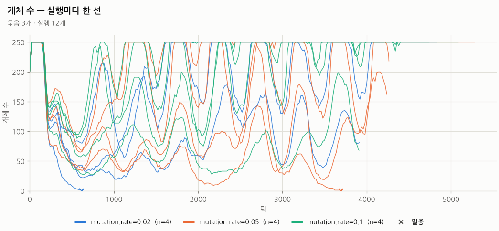
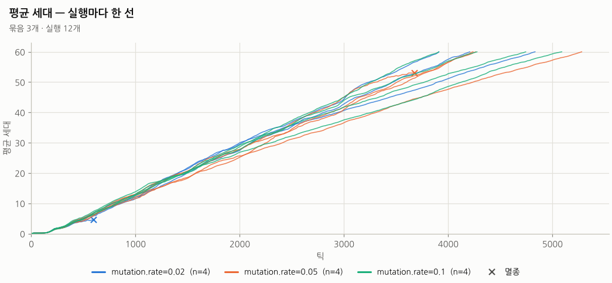
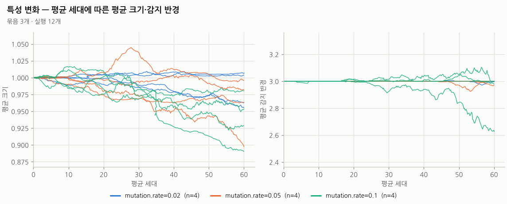
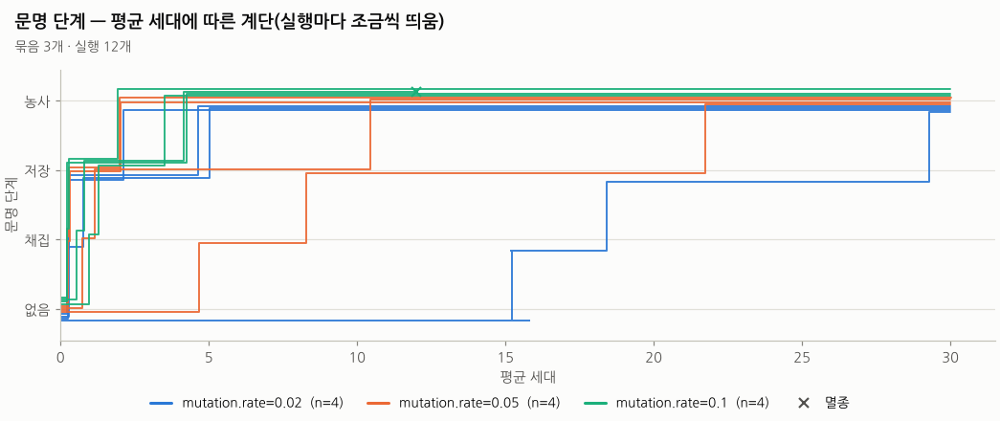

# 실험 분석 보고서

- 결과 폴더: `example-sweep` — 실행 **12개**, 묶음 **3개**
- 예설정 `fast_civ` · 목표 평균 세대 60.0 · 덮어쓰기 묶음마다 다름(`summary.csv` 의 `overrides` 열)
- 표: [`summary.csv`](summary.csv)(실행마다 한 줄), [`cells.csv`](cells.csv)(묶음별 집계). 만든 명령: `python3 tools/analyze.py report <결과 폴더>`

## 묶음별 요약

| 묶음 | 실행 | 멸종 | 채집 도달 | 저장 도달 | 농사 도달 | 끝 평균 세대(중앙값) | 틱(중앙값) | 끝 개체 수(중앙값) | 실행 시간 합(초) |
| --- | ---: | ---: | ---: | ---: | ---: | ---: | ---: | ---: | ---: |
| `mutation.rate=0.02` | 4 | 0% (0/4) | 100% (4/4) | 100% (4/4) | 75% (3/4) | 60.0 | 4,328 | 250 | 145.9 |
| `mutation.rate=0.05` | 4 | 0% (0/4) | 100% (4/4) | 100% (4/4) | 75% (3/4) | 60.0 | 4,266 | 242 | 122.7 |
| `mutation.rate=0.1` | 4 | 0% (0/4) | 100% (4/4) | 75% (3/4) | 50% (2/4) | 60.0 | 4,257 | 242 | 111.8 |

## 발견 세대

도달한 실행만으로 계산한 **중앙값 [Q1–Q3]** (괄호 안 = 도달한 실행/전체). 발견하지 못한 실행은 빠지므로 도달 비율과 함께 읽습니다.

| 묶음 | 채집 | 저장 | 농사 |
| --- | ---: | ---: | ---: |
| `mutation.rate=0.02` | 11.8 [8.8–22.4] (4/4) | 14.9 [11.0–26.0] (4/4) | 22.4 [16.5–26.0] (3/4) |
| `mutation.rate=0.05` | 14.8 [5.8–25.9] (4/4) | 22.0 [7.0–37.7] (4/4) | 20.0 [16.3–34.5] (3/4) |
| `mutation.rate=0.1` | 21.9 [3.4–44.8] (4/4) | 4.3 [3.7–28.7] (3/4) | 8.6 [7.2–10.0] (2/4) |

## 실행별 결과

| 묶음 | 씨앗 | 끝난 이유 | 틱 | 평균 세대 | 개체 | 최고 | 단계 | 채집 세대 | 저장 세대 | 농사 세대 | 끝 크기 | 끝 감지 | 시간(초) | 해시 |
| --- | ---: | --- | ---: | ---: | ---: | ---: | --- | ---: | ---: | ---: | ---: | ---: | ---: | --- |
| `mutation.rate=0.02` | 1 | 세대 도달 | 4,352 | 60.1 | 28 | 250 | 저장 | 52.16 | 55.44 | — | 1.01 | 3.00 | 22.4 | `e8d89855ea0b` |
| `mutation.rate=0.02` | 2 | 세대 도달 | 4,081 | 60.0 | 250 | 250 | 농사 | 11.04 | 16.22 | 29.53 | 0.96 | 3.00 | 38.1 | `4a656173a145` |
| `mutation.rate=0.02` | 3 | 세대 도달 | 4,305 | 60.0 | 250 | 250 | 농사 | 12.54 | 13.66 | 22.40 | 0.96 | 3.00 | 39.7 | `efddbf2e7e8b` |
| `mutation.rate=0.02` | 4 | 세대 도달 | 4,510 | 60.0 | 250 | 250 | 농사 | 2.22 | 2.86 | 10.70 | 1.00 | 3.00 | 45.8 | `ffe747d3a24c` |
| `mutation.rate=0.05` | 1 | 세대 도달 | 3,966 | 60.0 | 52 | 250 | 농사 | 33.87 | 36.22 | 49.02 | 1.00 | 3.00 | 24.8 | `882e526e4f2b` |
| `mutation.rate=0.05` | 2 | 세대 도달 | 4,703 | 60.0 | 250 | 250 | 농사 | 4.19 | 4.84 | 12.67 | 0.98 | 3.00 | 44.5 | `d343eaa7762e` |
| `mutation.rate=0.05` | 3 | 세대 도달 | 4,304 | 60.0 | 233 | 250 | 저장 | 23.27 | 42.13 | — | 0.90 | 2.97 | 28.8 | `00eecc779cb3` |
| `mutation.rate=0.05` | 4 | 세대 도달 | 4,228 | 60.0 | 250 | 250 | 농사 | 6.27 | 7.77 | 19.99 | 0.96 | 3.00 | 24.7 | `89476ad96982` |
| `mutation.rate=0.1` | 1 | 세대 도달 | 3,718 | 60.0 | 88 | 250 | 채집 | 59.25 | — | — | 0.89 | 3.00 | 11.5 | `3f7b4998fae9` |
| `mutation.rate=0.1` | 2 | 세대 도달 | 4,957 | 60.0 | 250 | 250 | 농사 | 2.24 | 3.20 | 5.76 | 0.95 | 3.00 | 37.8 | `5f9913fe8d9e` |
| `mutation.rate=0.1` | 3 | 세대 도달 | 4,264 | 60.0 | 235 | 250 | 저장 | 40.02 | 53.12 | — | 0.98 | 2.63 | 30.8 | `30ad06a0daac` |
| `mutation.rate=0.1` | 4 | 세대 도달 | 4,250 | 60.0 | 250 | 250 | 농사 | 3.73 | 4.26 | 11.36 | 0.93 | 2.98 | 31.7 | `657307bbf93b` |

## 그림

### 개체 수

실행마다 얇은 선 하나(가로 틱, 세로 살아 있는 개체 수, 묶음 색). 멸종한 실행은 끝에 ×. 개체 수 상한(population.cap)에 붙어 있으면 먹이보다 상한이 개체 수를 정하고 있다는 뜻.

### 평균 세대

틱에 따른 살아 있는 개체의 평균 세대. 기울기 = 세대 교체 속도(세대당 틱의 역수). 크기가 작아지는 진화가 일어나면 후반에 기울기가 바뀐다.

### 특성 변화

가로 평균 세대, 세로 평균 크기(왼쪽)·평균 감지 반경(오른쪽). 대사 비용 압력으로 둘 다 줄어드는지, 묶음(파라미터)마다 다른지 본다.

### 문명 단계

가로 평균 세대, 세로 문명 단계(없음·채집·저장·농사) 계단선. 선이 겹치지 않게 실행마다 세로로 조금씩 띄웠다. 계단이 오른쪽에 있을수록 늦게 발견. 멸종한 실행은 끝에 ×.

### 발견 세대

단계(채집·저장·농사)마다 한 칸. 세로 = 묶음, 점 = 실행 하나의 발견 세대, 회색 상자 = 사분위 범위(실행 3개 이상일 때), 굵은 검은 선 = 중앙값, 오른쪽 숫자 = 도달한 실행/전체 실행.

## 읽는 법

- **발견 세대** = 그 실행의 `chronicle.csv` 에서 `kind = discovery` 인 사건 줄의 `mean_gen`(발견이 일어난 틱에 살아 있던 개체들의 평균 세대, 0.01 단위). 단계는 문장 머리(`채집 발견 — …`)로 가립니다.
- **도달 비율** = 끝날 때 문명 단계(`civ_stage`)가 그 단계 이상인 실행의 비율. **멸종 비율** = 끝난 이유가 멸종인 실행의 비율.
- **끝 평균 세대**: 멸종한 실행은 멸종 직전(살아 있던 마지막 시계열 줄, 최대 기록 간격 20틱 전)의 평균 세대입니다(빈 개체의 평균 0 을 쓰면 중앙값이 내려가 진화가 느린 것처럼 보이므로).
- 사분위는 numpy 기본(선형 보간) 백분위수입니다. 실행이 적으면(씨앗 4개 등) 사분위 범위는 거칠게 읽어야 합니다.
- 실행이 목표 세대에서 멈추므로, 목표보다 늦게 올 발견은 "도달 못 함"으로 보입니다(오른쪽 중도 절단).
- 같은 씨앗·같은 설정이면 역사 해시가 같습니다(결정성). 해시가 다르면 설정이나 코드가 다릅니다.
